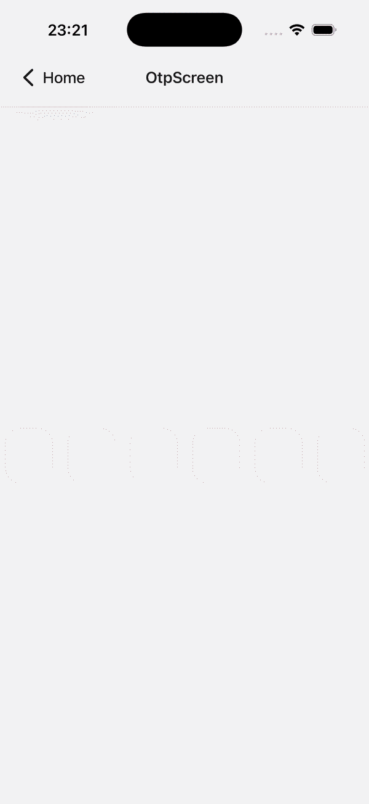
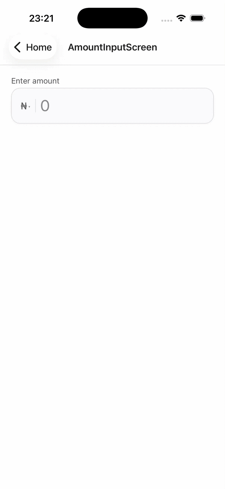
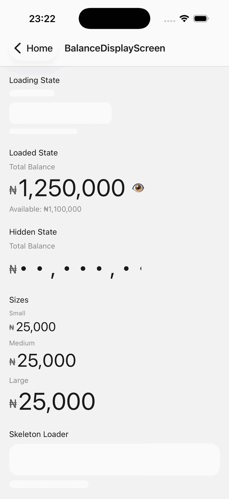
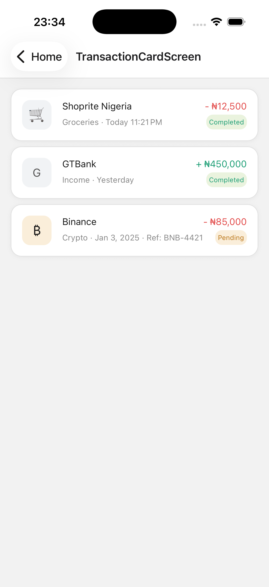

<div align="center">

<h1>react-native-fintech-kit</h1>

<p>Production-ready React Native UI components for fintech applications.<br/>TypeScript-first · Restyle-powered · Dark mode ready · iOS & Android</p>

<!-- Replace the src values below with your actual uploaded GIF URLs -->
<table>
  <tr>
    <td align="center">
      <br/>
      <sub>OTP Input</sub>
    </td>
    <td align="center">
      <br/>
      <sub>Amount Input</sub>
    </td>
    <td align="center">
      <br/>
      <sub>Balance Display</sub>
    </td>
    <td align="center">
      <br/>
      <sub>Transaction Card</sub>
    </td>
  </tr>
</table>

[](https://www.npmjs.com/package/react-native-fintech-kit)
[](LICENSE)
[](https://developer.apple.com)
[](https://developer.android.com)

</div>

---

## Components

| Component                               | Description                                                     |
| --------------------------------------- | --------------------------------------------------------------- |
| [`OtpInput`](#otpinput)                 | SMS autofill, shake on error, configurable length               |
| [`AmountInput`](#amountinput)           | Live currency formatting, currency selector trigger, validation |
| [`BalanceDisplay`](#balancedisplay)     | Blur+fade hide animation, skeleton loading, size variants       |
| [`TransactionCard`](#transactioncard)   | Credit/debit, status badges, merchant avatars                   |
| [`CurrencySelector`](#currencyselector) | Searchable bottom sheet, emoji flags                            |
| [`SkeletonLoader`](#skeletonloader)     | Shimmer animation, balance and block variants                   |

---

## Installation

```sh
npm install react-native-fintech-kit
# or
yarn add react-native-fintech-kit
```

### Peer dependencies

This library requires the following packages to be installed in your app:

```sh
yarn add @shopify/restyle react-native-reanimated @gorhom/bottom-sheet react-native-gesture-handler react-native-safe-area-context
```

| Package                        | Version   | Required                           |
| ------------------------------ | --------- | ---------------------------------- |
| `@shopify/restyle`             | `>=2.4.0` | ✅ Yes                             |
| `react-native-reanimated`      | `>=3.0.0` | ✅ Yes                             |
| `@gorhom/bottom-sheet`         | `>=5.0.0` | Only if using `CurrencySelector`   |
| `react-native-gesture-handler` | `>=2.0.0` | Only if using `CurrencySelector`   |
| `react-native-haptic-feedback` | `>=2.0.0` | Optional — enhances touch feedback |

Follow the setup guides for [Reanimated](https://docs.swmansion.com/react-native-reanimated/docs/fundamentals/getting-started) and [Gorhom Bottom Sheet](https://gorhom.dev/react-native-bottom-sheet/) for native linking.

---

## Setup

### 1. Babel config

Add the required plugins to your `babel.config.js`. Plugin order matters:

```js
module.exports = {
  presets: ['module:@react-native/babel-preset'],
  plugins: [
    'react-native-worklets/plugin', // must be first
    'react-native-reanimated/plugin', // must be last
  ],
};
```

### 2. App entry point

Import Reanimated before anything else in your app's root entry file:

```js
// index.js
import 'react-native-reanimated';
import { AppRegistry } from 'react-native';
import App from './src/App';
import { name as appName } from './app.json';

AppRegistry.registerComponent(appName, () => App);
```

### 3. Wrap your app

```tsx
// App.tsx
import React from 'react';
import { GestureHandlerRootView } from 'react-native-gesture-handler';
import { FintechKitProvider } from 'react-native-fintech-kit';

export default function App() {
  return (
    <GestureHandlerRootView style={{ flex: 1 }}>
      <FintechKitProvider>{/* your app */}</FintechKitProvider>
    </GestureHandlerRootView>
  );
}
```

---

## Components

### OtpInput

A fully controlled OTP input with SMS autofill, paste handling, shake animation on error, and per-cell focus animations.

```tsx
import { OtpInput } from 'react-native-fintech-kit';

const [code, setCode] = useState('');

<OtpInput
  value={code}
  onChange={setCode}
  onComplete={(value) => verifyCode(value)}
/>;
```

**Props**

| Prop              | Type                      | Default | Description                             |
| ----------------- | ------------------------- | ------- | --------------------------------------- |
| `value`           | `string`                  | —       | Controlled value                        |
| `onChange`        | `(value: string) => void` | —       | Called on every change                  |
| `onComplete`      | `(value: string) => void` | —       | Called when all digits are filled       |
| `length`          | `number`                  | `6`     | Number of OTP digits                    |
| `error`           | `boolean`                 | `false` | Triggers shake animation and red border |
| `secureTextEntry` | `boolean`                 | `false` | Masks digits with bullets               |
| `disabled`        | `boolean`                 | `false` | Disables all inputs                     |
| `testID`          | `string`                  | —       | Test automation ID                      |

---

### AmountInput

A currency-aware input with live thousand-separator formatting, cursor position preservation, min/max validation, and an optional currency selector trigger.

```tsx
import { AmountInput } from 'react-native-fintech-kit';

const [amount, setAmount] = useState(0);

// Basic
<AmountInput
  value={amount}
  onChange={setAmount}
/>

// With validation
<AmountInput
  value={amount}
  onChange={setAmount}
  currency="₦"
  decimals={0}
  min={100}
  max={10_000_000}
  minErrorMessage="Minimum transfer is ₦100"
  maxErrorMessage="Maximum transfer is ₦10,000,000"
  label="Enter amount"
  onValidChange={(val) => console.log('valid:', val)}
/>

// With currency selector
<AmountInput
  value={amount}
  onChange={setAmount}
  currency={selectedCurrency.symbol}
  onCurrencyPress={() => setSelectorOpen(true)}
/>
```

**Props**

| Prop              | Type                      | Default | Description                                  |
| ----------------- | ------------------------- | ------- | -------------------------------------------- |
| `value`           | `number`                  | —       | Raw numeric value                            |
| `onChange`        | `(value: number) => void` | —       | Called with raw numeric value                |
| `currency`        | `string`                  | `'₦'`   | Currency symbol prefix                       |
| `decimals`        | `number`                  | `2`     | `0` for whole numbers, `2` for standard      |
| `min`             | `number`                  | —       | Minimum allowed value                        |
| `max`             | `number`                  | —       | Maximum allowed value                        |
| `minErrorMessage` | `string`                  | —       | Error shown when value < min                 |
| `maxErrorMessage` | `string`                  | —       | Error shown when value > max                 |
| `errorMessage`    | `string`                  | —       | External error — overrides validation errors |
| `label`           | `string`                  | —       | Label shown above the input                  |
| `placeholder`     | `string`                  | `'0'`   | Placeholder when empty                       |
| `onCurrencyPress` | `() => void`              | —       | Makes currency symbol a tappable trigger     |
| `onValidChange`   | `(value: number) => void` | —       | Called only when validation passes           |
| `disabled`        | `boolean`                 | `false` |                                              |
| `testID`          | `string`                  | —       |                                              |

---

### BalanceDisplay

Displays a formatted currency balance with a blur+fade hide/show animation, optional skeleton loading state, and size variants.

```tsx
import { BalanceDisplay } from 'react-native-fintech-kit';

const [isHidden, setIsHidden] = useState(false);

// Loading state
<BalanceDisplay value={0} isLoading={true} label="Total Balance" />

// Full usage
<BalanceDisplay
  value={1_250_000}
  currencyCode="NGN"
  currencySymbol="₦"
  isHidden={isHidden}
  onToggleHidden={() => setIsHidden(prev => !prev)}
  label="Total Balance"
  subtext="Available: ₦1,100,000"
  size="large"
/>
```

**Props**

| Prop             | Type                             | Default    | Description                      |
| ---------------- | -------------------------------- | ---------- | -------------------------------- |
| `value`          | `number`                         | —          | Numeric balance                  |
| `currencyCode`   | `string`                         | `'NGN'`    | Used to determine decimal places |
| `currencySymbol` | `string`                         | `'₦'`      | Displayed prefix symbol          |
| `isHidden`       | `boolean`                        | `false`    | Blurs and fades the balance      |
| `onToggleHidden` | `() => void`                     | —          | Eye icon appears when provided   |
| `isLoading`      | `boolean`                        | `false`    | Shows skeleton loader            |
| `label`          | `string`                         | —          | Small label above balance        |
| `subtext`        | `string`                         | —          | Secondary line below balance     |
| `size`           | `'small' \| 'medium' \| 'large'` | `'medium'` |                                  |
| `testID`         | `string`                         | —          |                                  |

---

### TransactionCard

A transaction list item with merchant avatar, formatted amount, relative date, and status badge. Tap handler is optional — navigation is the consumer's responsibility.

```tsx
import { TransactionCard, type Transaction } from 'react-native-fintech-kit';

const transaction: Transaction = {
  id: '1',
  merchantName: 'Shoprite Nigeria',
  merchantIcon: '🛒',
  category: 'Groceries',
  amount: 12500,
  currencySymbol: '₦',
  currencyCode: 'NGN',
  type: 'debit',
  status: 'completed',
  date: new Date(),
};

<TransactionCard
  transaction={transaction}
  onPress={(t) => navigation.navigate('TransactionDetail', { id: t.id })}
/>;
```

**Transaction type**

```ts
type Transaction = {
  id: string;
  merchantName: string;
  merchantIcon?: string; // emoji — falls back to first letter of merchantName
  category?: string;
  amount: number;
  currencySymbol?: string; // default '₦'
  currencyCode?: string; // default 'NGN'
  type: 'debit' | 'credit';
  status: 'completed' | 'pending' | 'failed';
  date: string | Date;
  reference?: string;
};
```

**Props**

| Prop          | Type                                 | Description                             |
| ------------- | ------------------------------------ | --------------------------------------- |
| `transaction` | `Transaction`                        | Transaction data object                 |
| `onPress`     | `(transaction: Transaction) => void` | Optional — enables tap interaction      |
| `dateLabel`   | `string`                             | Override the auto-formatted date string |
| `testID`      | `string`                             |                                         |

---

### CurrencySelector

A searchable bottom sheet currency picker with emoji flags, currency codes, and a selected state indicator.

```tsx
import { CurrencySelector, type Currency } from 'react-native-fintech-kit';

const CURRENCIES: Currency[] = [
  { code: 'NGN', symbol: '₦', name: 'Nigerian Naira', flag: '🇳🇬' },
  { code: 'USD', symbol: '$', name: 'US Dollar', flag: '🇺🇸' },
  { code: 'GBP', symbol: '£', name: 'British Pound', flag: '🇬🇧' },
];

const [isOpen, setIsOpen] = useState(false);
const [selected, setSelected] = useState(CURRENCIES[0]);

<CurrencySelector
  isOpen={isOpen}
  currencies={CURRENCIES}
  selectedCode={selected.code}
  onSelect={(currency) => {
    setSelected(currency);
    setIsOpen(false);
  }}
  onClose={() => setIsOpen(false)}
/>;
```

**Props**

| Prop                | Type                           | Default                | Description                          |
| ------------------- | ------------------------------ | ---------------------- | ------------------------------------ |
| `isOpen`            | `boolean`                      | —                      | Controls sheet open state            |
| `currencies`        | `Currency[]`                   | —                      | List of currencies to display        |
| `selectedCode`      | `string`                       | —                      | Currently selected currency code     |
| `onSelect`          | `(currency: Currency) => void` | —                      | Called when a currency is tapped     |
| `onClose`           | `() => void`                   | —                      | Called on backdrop tap or swipe down |
| `snapPoint`         | `string`                       | `'55%'`                | Bottom sheet height                  |
| `searchPlaceholder` | `string`                       | `'Search currency...'` |                                      |
| `testID`            | `string`                       | —                      |                                      |

---

### SkeletonLoader

A shimmer skeleton loader for balance displays and generic blocks.

```tsx
import { SkeletonLoader } from 'react-native-fintech-kit';

// Balance variant — matches BalanceDisplay layout
<SkeletonLoader variant="balance" showLabel={true} />

// Generic block — use for any loading placeholder
<SkeletonLoader variant="block" width="100%" height={56} borderRadius={16} />
<SkeletonLoader variant="block" width={140} height={14} borderRadius={7} />
```

**Props — `variant="balance"`**

| Prop        | Type      | Default | Description                        |
| ----------- | --------- | ------- | ---------------------------------- |
| `showLabel` | `boolean` | `true`  | Shows label skeleton above balance |

**Props — `variant="block"`**

| Prop           | Type             | Default | Description  |
| -------------- | ---------------- | ------- | ------------ |
| `width`        | `DimensionValue` | —       | Block width  |
| `height`       | `number`         | —       | Block height |
| `borderRadius` | `number`         | `8`     |              |

---

## Customization

All components read from a global config passed to `FintechKitProvider`. Every option has a built-in default — only override what you need.

```tsx
<FintechKitProvider
  config={{
    otpInput: {
      cellSize: { width: 60, height: 72 },
      cellBorderRadius: 8,
      fontSize: 24,
      fontFamily: 'Inter-Bold',
      activeBorderColor: 'primary',
    },
    amountInput: {
      height: 72,
      borderRadius: 12,
      fontSize: 32,
    },
    balanceDisplay: {
      fontFamily: 'Inter-Bold',
    },
    transactionCard: {
      borderRadius: 12,
      iconSize: 48,
    },
    button: {
      borderRadius: 8,
      height: 56,
    },
  }}
>
  <App />
</FintechKitProvider>
```

---

## Dark mode

Dark mode is built in. Call `useThemeMode` anywhere inside `FintechKitProvider` to toggle:

```tsx
import { useThemeMode } from 'react-native-fintech-kit';

const ThemeToggle = () => {
  const { mode, toggle } = useThemeMode();

  return (
    <Button onPress={toggle}>
      {mode === 'light' ? 'Switch to dark' : 'Switch to light'}
    </Button>
  );
};
```

---

## Utility functions

The currency formatting engine is exported for use throughout your app:

```ts
import {
  formatAmount,
  parseFormattedAmount,
  getDecimalsForCurrency,
  validateAmount,
  formatTransactionDate,
} from 'react-native-fintech-kit';

// Format a number for display
formatAmount(1250000, { decimals: 0 }); // '1,250,000'
formatAmount(1250.5, { decimals: 2 }); // '1,250.50'

// Parse a formatted string back to a number
parseFormattedAmount('1,250,000'); // 1250000

// Get the correct decimal count for a currency
getDecimalsForCurrency('NGN'); // 0
getDecimalsForCurrency('USD'); // 2

// Validate an amount
validateAmount(50, { min: 100, minErrorMessage: 'Too low' }); // 'Too low'
validateAmount(500, { min: 100, max: 1000 }); // null (valid)

// Format a transaction date relatively
formatTransactionDate(new Date()); // 'Today 2:14pm'
formatTransactionDate(yesterday); // 'Yesterday'
formatTransactionDate(new Date('2025-01-03')); // '3 Jan'
```

---

## Fonts

Components use the **Onest** font family. To use them, add the font files to your app and link them.

Add to your `react-native.config.js`:

```js
module.exports = {
  assets: ['./node_modules/react-native-fintech-kit/src/assets/fonts'],
};
```

Then link:

```sh
npx react-native-asset
```

Alternatively, pass your own `fontFamily` via the config system to use whatever fonts your app already has installed.

---

## Contributing

See [CONTRIBUTING.md](CONTRIBUTING.md) for how to run the project locally, submit issues, and open pull requests.

To run the example app:

```sh
yarn install
yarn example ios
# or
yarn example android
```

---

## License

MIT © [Oluwamurewa Alao](https://github.com/mureyvenom)
